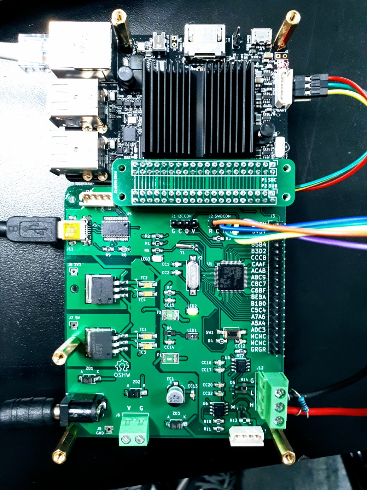

# Oceanside

This repository explains that how I have developed a prototype telemetry project based on the famous data science computing platform "Jupyter (hub)" and a RTOS "ChibiOS".  
  
본 프로젝트는 이미 널리 알려진 데이터 사이언스 플랫폼인 Jupyter (hub)와 ARM Cortex 기반 RTOS인 ChibiOS를 이용하여 프로토타입 원격 제어계측 프로젝트를 개발하는 내용을 담고 있습니다. 

## Maintainer
  
SJ Kim  
- Profile: [bus710.net](http://bus710.net)  
- Contact: <<bus710@gmail.com>>  

## Disclaimer

This project shows developing a certain computer system. Please be aware that the arthor doesn't have responsibility about anything, which cause harmful result in physical, mental, and financial if you follow it. 

## Table of Contents
- [Summary](#summary)
- [Hardware](#hardware)
- [ChibiOS](#chibios)
- [Jupyter](#jupyter)
- [Reference](#reference)

## Summary

Nowadays, Embedded Engineers are not only requested to develop realtime embedded software but also requested to develop data analysis system to monitor realtime data. In order to satisfy the needs, having rapid prototyping tools might be helpful to show the proof of the concept in your idea note. 

Here I share a simple project about the way I tried to make a combination of Jupyter and ChibiOS so that readers can utilize it to build your own telemetry project. The following sections are linked to sub documents to explain the detail of each steps to build sub modules to make our eventual application, which would work seamlessly.

**In writing this guide there is an assumption that the reader is well experienced about Linux. In fact, all the step will be done in both Desktop (Mint 18) and ARM aarch64 server (Ubuntu 16.04.2).**

## Hardware

[How to Make the Hardware](00_doc/01_hardware.md): 
This section explains how to get/make the required hardware. Kicad and Draftsight are used for the custom hardware but don't worry! since the design files (gerber and dxf) for this project are provided in this repository.

## ChibiOS

[How to develop ChibiOS project](00_doc/02_chibios.md):
This section explains how to install the realted tools and develop the actual ChibiOS based realtime firmware.  

## Jupyter

[How to connect jupyter notebooks and MBED](00_doc/03_jupyterhub.md): This section explains how to install the related tools and develop jupyter notebook. 

## Reference

1. [aaa]()
2. [aaa]()
3. [aaa]()
